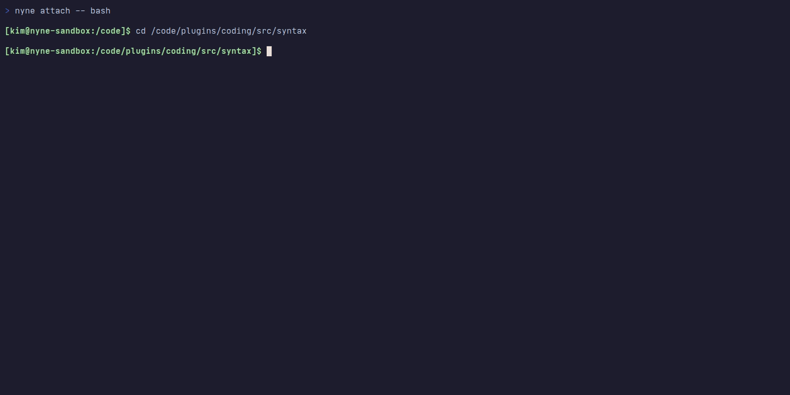

# nyne

**Plan 9 insisted that everything should be a file.** The idea influenced decades of systems design, but never became the default. LLMs change the equation: forty years of `cat`, `grep`, and `sed` on unchanged interfaces across the internet means file operations are baked in. Your custom 500-token `get_file_symbols` schema can't be piped, grepped or composed, and has to be learned from scratch every single session.

Irrelevant context is the biggest bottleneck in agent-driven development. An agent reads a whole file to find one function, and everything else enters the context window. nyne exposes your codebase as decomposed, scoped files agents already know how to use, through a FUSE overlay over your project.

## What it looks like

<p align="center"></p>

```sh
# What's in this file?
cat lib.rs@/symbols/OVERVIEW.md
```

```
 Symbol                Kind       Lines    Tokens
 Config                struct     12-28    140
 process_data          fn         184-209  320
 validate              fn         211-245  280
 ...
```

```sh
# Read just the function (25 lines, not 400)
cat lib.rs@/symbols/process_data.rs

# Who calls it?
cat lib.rs@/symbols/process_data@/CALLERS.md

# Rename it project-wide, LSP-validated
mv lib.rs@/symbols/process_data@/ lib.rs@/symbols/transform_data@/

# Grep across function bodies, not files
grep -r "unwrap" src/**/*.rs@/symbols/*@/body.rs

# Every version of a function, as readable files
ls lib.rs@/symbols/process_data@/git/history/

# Diff any two versions
diff <(cat lib.rs@/symbols/process_data@/git/history/001_*.rs) \
    <(cat lib.rs@/symbols/process_data@/git/history/005_*.rs)
```

```sh
# Navigate a 1500-line task plan by section
cat plan.md@/symbols/OVERVIEW.md
```

```
 Symbol              Kind       Lines    Tokens
 10-discovery        section    1-40     320
 20-implementation   section    41-180   1200
 30-validation       section    181-220  280
```

```sh
# Read just phase 2 (not 1500 lines)
cat plan.md@/symbols/20-implementation.md

# Fenced code blocks extracted as editable files
cat plan.md@/symbols/20-implementation@/symbols/migration.sql
```

Nobody wants to type `file.rs@/symbols/Foo@/callers/init.rs` at a terminal, and nobody has to. The paths are designed for tools, not fingers, but what they surface is useful to anyone: call graphs, LSP diagnostics, git history, all as scoped reads.

## Try it now

> **Status:** Pre-release. Not yet published to crates.io. Requires Rust 1.93+ and Linux (FUSE).

```sh
git clone https://github.com/Lokaltog/nyne && cd nyne
cargo install --path .

# Mount the repo (backgrounded, overlays in-place)
nyne mount &

# Attach your $SHELL with full VFS visibility
nyne attach --visibility all
```

## CLI

| Command                     | Purpose                                       |
| --------------------------- | --------------------------------------------- |
| `nyne mount [paths...]`     | Start FUSE daemon for one or more directories |
| `nyne attach [id] [-- cmd]` | Enter a mount's sandboxed namespace           |
| `nyne list [id]`            | Show active sessions and attached processes   |
| `nyne exec <address>`       | Run a registered script against a daemon      |
| `nyne ctl [request]`        | Send a JSON control request to a daemon       |
| `nyne config`               | Dump resolved configuration                   |

```sh
# Mount a project, then run an agent inside the namespace
nyne mount &
nyne attach -- claude
```

See **[Usage](USAGE.md)** for the full command reference and examples.

## Why

If you've ever watched an agent refactor, you're familiar with the joy of watching context rot in real-time. 50K tokens in, re-reading files from three steps ago. Five files into a call graph, useful context is buried under thousands of irrelevant lines. nyne solves this at the filesystem level. When an agent asks for a function body, that's what it gets. Callers, diagnostics, git history are separate, scoped reads.

Raw shell access lets agents pipe, grep, and compose, but also hands them unrestricted access to `.env` and `~/diary`. nyne sits in between. Mutations land in an overlay, not on your source tree. The [Sandbox](#sandbox) section covers the full isolation model.

Tree-sitter validates every write before it touches disk. Syntax error? `EINVAL`, not a wasted build cycle three tool calls later. Writes are blocking: LSP diagnostics come back before the write returns.

## How it works

nyne overlays your project directory with a virtual `@/` namespace. Every source file nyne recognizes gets a companion tree with its decomposed structure. Everything else passes through as-is.

```
project/
  src/
    lib.rs                              # your source file (passthrough)
    lib.rs@/                            # virtual companion namespace
      OVERVIEW.md                       # symbol table: names, line ranges, token estimates
      symbols/
        process.rs                      # shorthand for process@/body.rs
        process@/
          body.rs                       # function body — read, write (splices back)
          signature.rs                  # declaration line — read, write
          docstring.txt                 # docstring — read, write, truncate
          CALLERS.md                    # incoming call sites (symlinked to caller symbols)
          DEPS.md                       # outgoing dependencies (symlinked to callee symbols)
          REFERENCES.md                 # all usage sites (symlinked to referencing symbols)
          actions/                      # LSP code actions as .diff files
            10-add-error-handling.diff
          git/
            LOG.md                      # commits touching this symbol
            BLAME.md                    # per-line authorship
            history/                    # every version of this symbol, as readable files
              001_2026-03-02_9dba138_feat-scaffold.rs
              002_2026-03-08_050e60e_refactor-sandbox.rs
          rename/
            new_name.diff               # LSP rename preview (lookup-only)
      rename/
        new_name.rs.diff                # file rename preview — import updates (lookup-only)
      git/
        BLAME.md                        # per-line authorship for the file
        LOG.md                          # commit log
      DIAGNOSTICS.md                    # compiler errors/warnings
      edit/                             # batch edit staging area
```

File extensions match the source language (`.py` for Python, `.ts` for TypeScript) so syntax highlighting works out of the box.

Symlinks connect the call graph: follow a caller into its `@/` namespace, check its diagnostics, follow _its_ callers. No file paths to resolve, you just keep reading. Mutations produce diffs you can inspect before applying. `mv` triggers LSP rename, code actions appear as `.diff` files, and tree-sitter validates every write before it touches disk.

## Sandbox

nyne runs agents inside Linux namespaces. Unprivileged user namespaces only, no containers or root required.

### Don't trust this README

Everything above describes what nyne _claims_ to do. You should not take our word for it (or anyone else's) when it comes to tools that give system access to an LLM.

Attach a shell to a running mount and poke around:

```sh
nyne attach
```

Try reading `/home`. Try writing outside `/code`. Try listing host processes with `ps aux`. Try accessing `.env` files in your home directory. Look at what's actually mounted:

```sh
mount | column -t
ls -la /
ls ~/
```

You'll see a tmpfs root with selective bind mounts, FUSE at `/code`, and a PID namespace showing only sandbox processes. Anything you can (and can't) do in there applies to agents as well.

<details>
<summary>What's actually isolated</summary>

The **daemon** (`nyne mount`) creates a user+mount namespace to serve FUSE. It retains mount capabilities for the overlay and nothing else.

**Attached processes** (`nyne attach`) get further isolation:

- **Mount namespace.** pivot_root into a tmpfs. Host `/` entries are selectively bind-mounted read-only. `/home` and `/tmp` excluded entirely.
- **PID namespace.** Only sandbox processes visible.
- **User remap.** Root in the mount namespace is dropped back to the real uid/gid before any user code runs.
- **Filesystem.** Root tmpfs is read-only after setup. Writable surfaces: `/code` (FUSE), XDG dirs (`~/.config`, `~/.cache`, `~/.local/share`, `~/.local/state`), `/tmp` (isolated tmpfs), `/dev`, `/run`.

Project files at `/code` go through FUSE. Writes land in an overlayfs upperdir, not on your source tree. Your real files stay untouched until you explicitly commit the overlay.

</details>

**This applies to every tool in this space, not just nyne.** Any project that gives an LLM shell access deserves five minutes of poking. That's all it takes to know whether your `/home` is actually walled off or just claimed to be.

## Development

```sh
just check # fmt → clippy → cargo check → tests
just test  # tests only
just lint  # fmt → clippy
just watch # cargo watch -x check
just doc   # build and open rustdoc
```

## Documentation

- **[Usage](USAGE.md)** — full CLI command reference and examples
- **[Workflows](WORKFLOWS.md)** — extended examples: pipes, sed, awk, find, xargs, batch operations, etc.
- **[Roadmap](ROADMAP.md)** — planned features and design explorations
